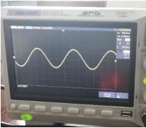
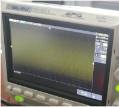

# Fountain_FPGA_Implementation

Code repository for the paper:  
**Efficient FPGA optimizations of lightweight Fountain authenticated stream cipher for IoT systems**
[Zhengyuan Shi](https://scholar.google.com.hk/citations?user=SQaM_UMAAAAJ), Cheng Chen, [Gangqiang Yang](https://scholar.google.com.hk/citations?user=UAoDCkUAAAAJ), Hailiang Xiong, Honggang Hu, [Zhiguo Wan](https://scholar.google.com.hk/citations?hl=zh-CN&user=8D7Vh20AAAAJ)

## Abstract
Fountain is a 128-bit lightweight stream cipher supporting authenticated encryption with associated data (AEAD). To fulfill the varying requirements of the Internet of things, we provide Fountain variants, which are customized for encryption, message authentication code (MAC) generation, and authenticated encryption with associated data respectively, in this paper. Besides, we propose the area-saved and throughput-improved strategies for the FPGA implementation of Fountain. The conventional paralleled hardware implementation leads to much resource-consuming with higher parallel width. We propose a hybrid architecture with parallel and serial update modes simultaneously. We also analyze the trade-off between area occupation and authentication latency for those two architectures. According to our discussion, the hybrid architectures can perform efficiently with higher throughput than most ciphers, including Grain 128 x32. Our Fountain keystream generator, which is only used for encryption, occupied 46 slices on Spartan-3 FPGAs, which are smaller than most same security level ciphers. It's even smaller than the 80-bit security level cipher Trivium, suitable for most compact devices. In summary, the customized Fountain with optimized implementations on FPGA is suitable for various applications in the field of IoT.

## Instruction
This is the hardware implementation of Fountain stream cipher. We recommand to implement this repo on PYNQ-Z2 board. 
The input signal is processed by an ADC module and encrypted by FPGA chip with high speed. Finally, the cipher text is produced via a DAC module. 

Left: before encryption; Right: after encryption





## QuickStart
The experiments are conducted on Linux, with vivado 2018.03

To set up the environment:
```sh
vivado dma_dac.xpr
```

